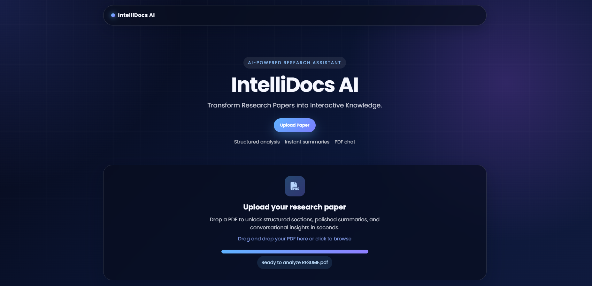

# IntelliDocs AI

IntelliDocs AI is a modern AI-powered web application that helps users upload research papers in PDF format and transform them into structured, interactive knowledge. The platform extracts section-based content, generates topic-wise summaries, and enables conversational Q&A over the uploaded document.

## Features

- Upload and process research paper PDFs
- Extract and organize paper sections
- Generate detailed summaries for each topic
- Chat with the uploaded PDF using AI-powered retrieval
- Clean and modern web interface for a polished user experience

## Tech Stack

- Python
- Flask
- LangChain
- Groq
- Hugging Face Embeddings
- HTML/CSS/JavaScript

## Installation

1. Clone the repository
2. Install dependencies:
   ```bash
   pip install -r requirements.txt
   ```
3. Set up your environment variables for the required API keys
4. Run the application:
   ```bash
   python app.py
   ```

## Usage

1. Open the app in your browser
2. Upload a research paper PDF
3. Select a topic from the extracted sections
4. View the generated summary
5. Ask questions about the paper through the chat interface

## Author

Built with ❤️ by Karthikeya
